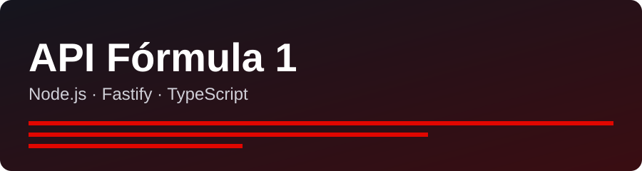

<div align="center">

  
  <h1><strong>API Fórmula 1 — Node.js + Fastify</strong></h1>
  <p>API leve e eficiente com CRUD de times e pilotos de F1, feita com <b>Node.js</b>, <b>TypeScript</b> e <b>Fastify</b>.</p>

</div>

## Sobre o desafio

Desafio de projeto da [DIO](https://www.dio.me/) (Formação Node.js Fundamentals). O projeto é baseado em [digitalinnovationone/node-formula-1](https://github.com/digitalinnovationone/node-formula-1), mantendo a mesma estrutura de pastas e arquitetura (um único `src/server.ts`, `.env`, `tsconfig.json`, `.github/assets`), mas evoluindo a API original.

### O que foi evoluído em relação ao original

- CRUD completo de **times** e **pilotos** (`GET`, `GET /:id`, `POST`, `PUT`, `DELETE`).
- Ids gerados pelo servidor e únicos (o original tinha dois pilotos com `id: 2`).
- Validação de `params`, `body` e `querystring` com JSON schema do Fastify (erros 400).
- Piloto vinculado ao time por `teamId`, com o nome do time na resposta.
- Filtro `GET /drivers?team=Ferrari` e rota de health-check em `GET /`.
- Grade de times atualizada, sem duplicidades.
- Porta configurável via `PORT` no `.env`.

## Passo a passo

1. Clonei a estrutura do repositório de referência (Fastify + `@fastify/cors`, `tsx` e `tsup`).
2. Configurei o TypeScript (`strict`, CommonJS) e os scripts `dist`, `start:dev`, `start:watch` e `start:dist`.
3. Modelei `Team` e `Driver` com dados em memória.
4. Implementei as rotas de times e pilotos com validação por schema e códigos HTTP adequados.
5. Testei cada rota manualmente com `curl` e documentei aqui.

## Tecnologias

- [Node.js](https://nodejs.org/) 20+
- [Fastify](https://fastify.dev/) e [@fastify/cors](https://github.com/fastify/fastify-cors)
- [TypeScript](https://www.typescriptlang.org/)
- [tsx](https://www.npmjs.com/package/tsx) para rodar TypeScript direto
- [tsup](https://www.npmjs.com/package/tsup) para o build

## Como rodar

```bash
npm install
cp .env.example .env
npm run start:dev
```

A API sobe em `http://localhost:3333` (ou na porta definida em `PORT`).

### Scripts

| Script | Descrição |
|---|---|
| `npm run dist` | Compila o TypeScript para `dist/` |
| `npm run start:dev` | Roda o servidor lendo o `.env` |
| `npm run start:watch` | Igual ao anterior, com reload automático |
| `npm run start:dist` | Compila e roda a versão de `dist/` |

## Rotas

| Método | Rota | Descrição | Sucesso | Erros |
|---|---|---|---|---|
| GET | `/` | Health-check | 200 | — |
| GET | `/teams` | Lista times | 200 | — |
| GET | `/teams/:id` | Busca um time | 200 | 400, 404 |
| POST | `/teams` | Cria time (`name`, `base`) | 201 | 400 |
| PUT | `/teams/:id` | Substitui time | 200 | 400, 404 |
| DELETE | `/teams/:id` | Remove time | 204 | 404, 409 (tem pilotos) |
| GET | `/drivers` | Lista pilotos (`?team=Ferrari` filtra) | 200 | — |
| GET | `/drivers/:id` | Busca um piloto | 200 | 400, 404 |
| POST | `/drivers` | Cria piloto (`name`, `teamId`) | 201 | 400 |
| PUT | `/drivers/:id` | Substitui piloto | 200 | 400, 404 |
| DELETE | `/drivers/:id` | Remove piloto | 204 | 404 |

### Exemplos

```bash
curl http://localhost:3333/drivers?team=Ferrari

curl -X POST http://localhost:3333/drivers \
  -H "Content-Type: application/json" \
  -d '{"name": "Carlos Sainz", "teamId": 7}'

curl -X PUT http://localhost:3333/teams/10 \
  -H "Content-Type: application/json" \
  -d '{"name": "Audi", "base": "Hinwil, Switzerland"}'

curl -X DELETE http://localhost:3333/drivers/7
```

> Os dados ficam em memória: reiniciar o servidor volta ao estado inicial.

## Créditos

Projeto de referência: [digitalinnovationone/node-formula-1](https://github.com/digitalinnovationone/node-formula-1).
